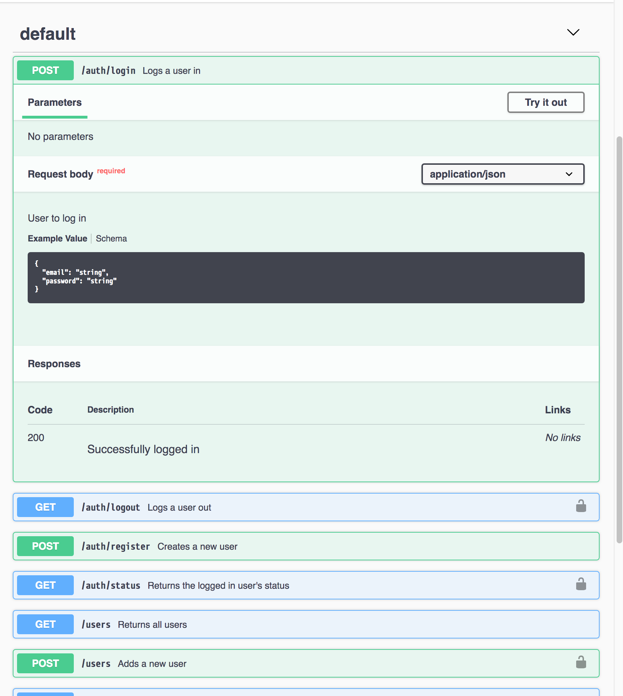
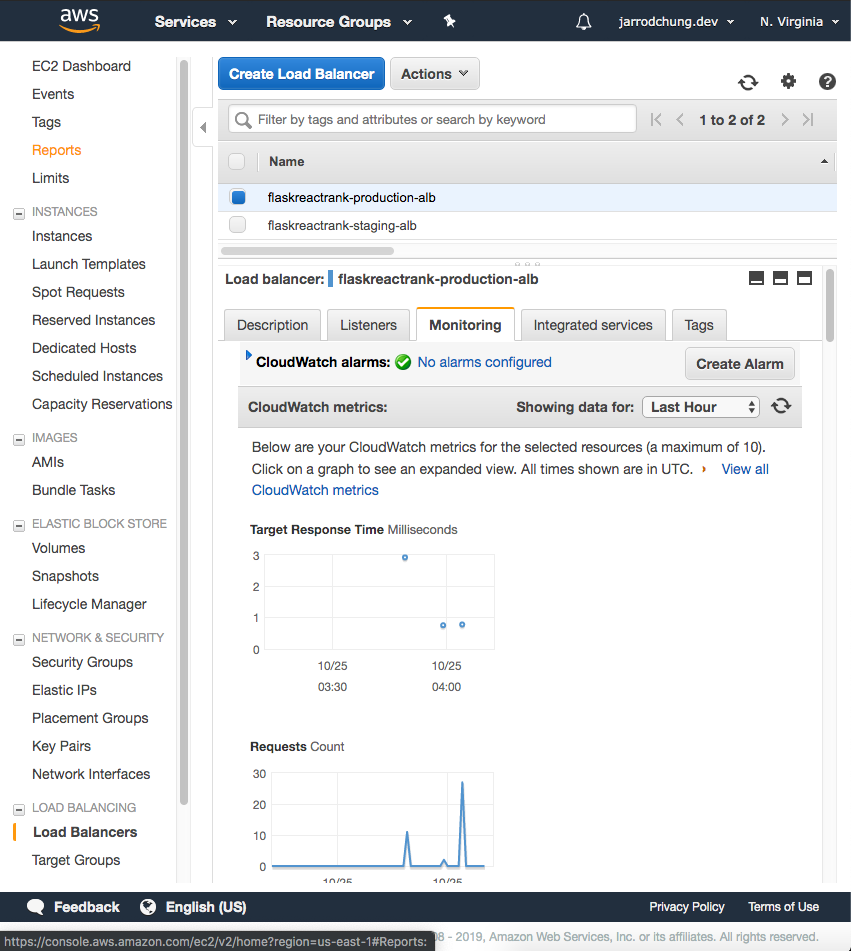
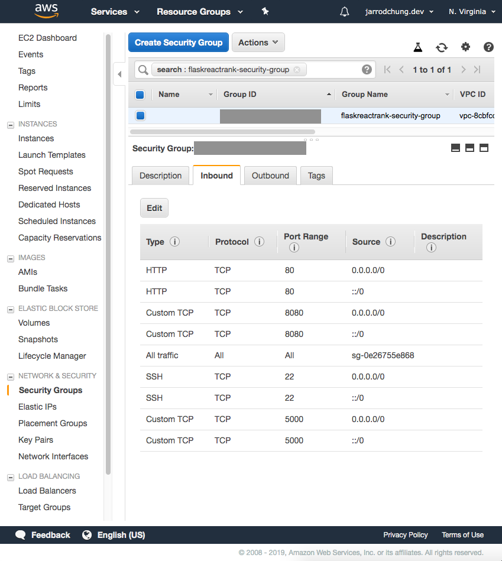
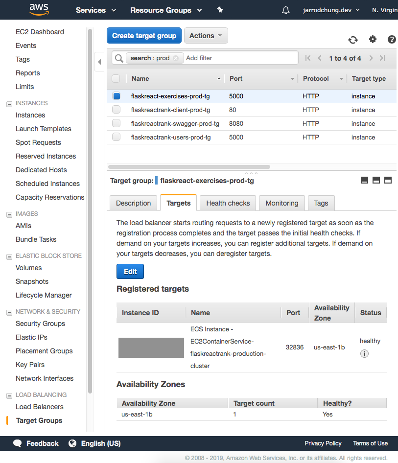
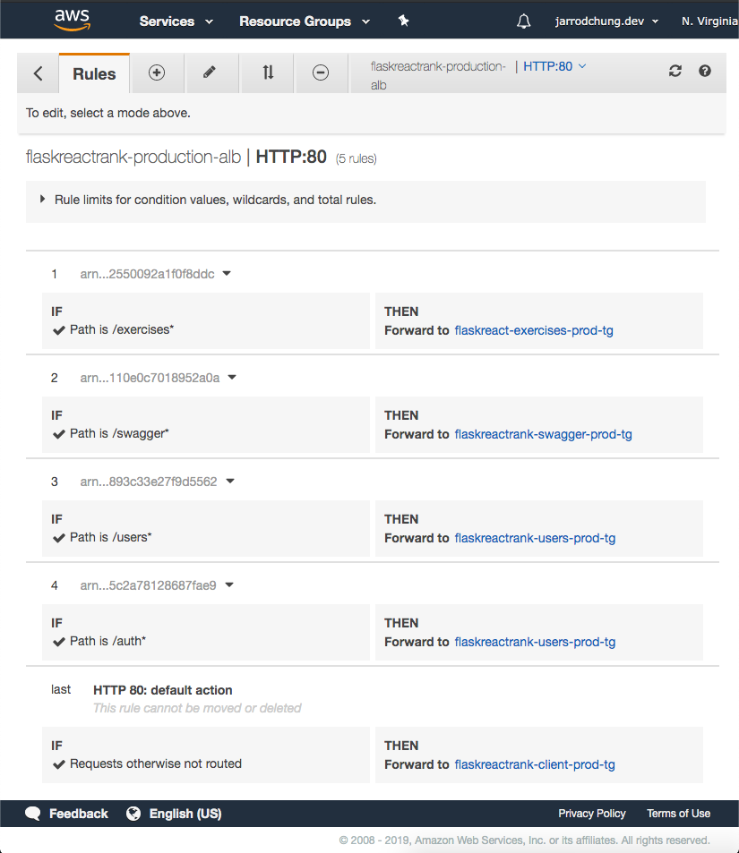
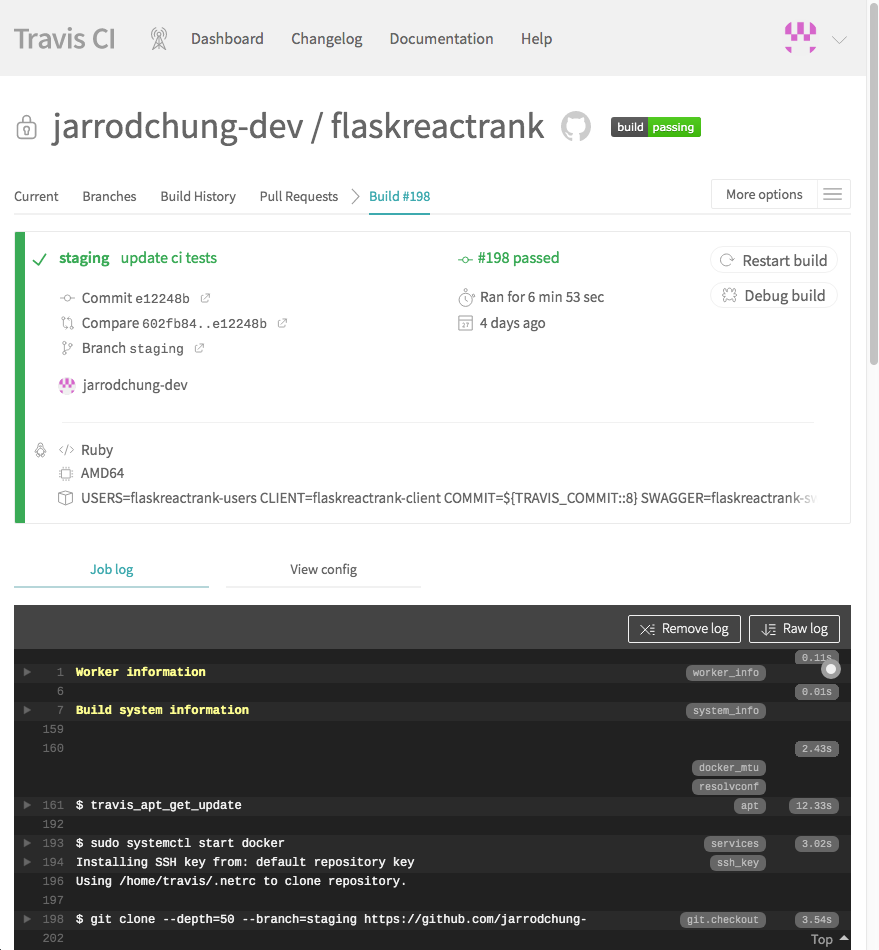
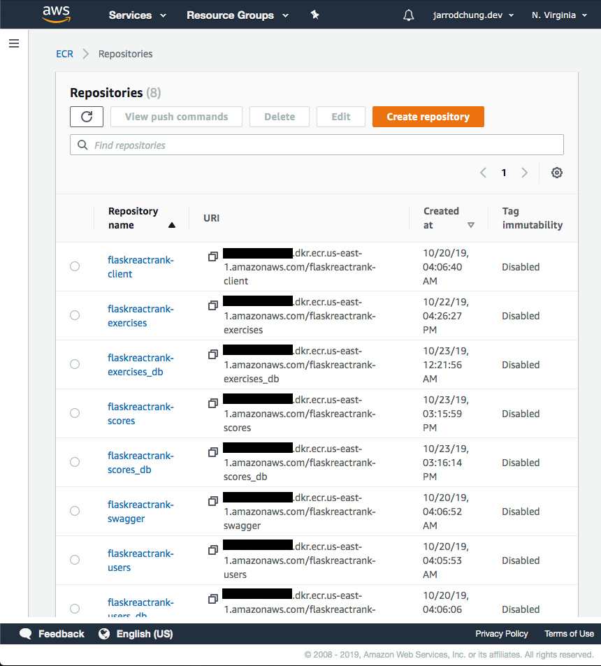
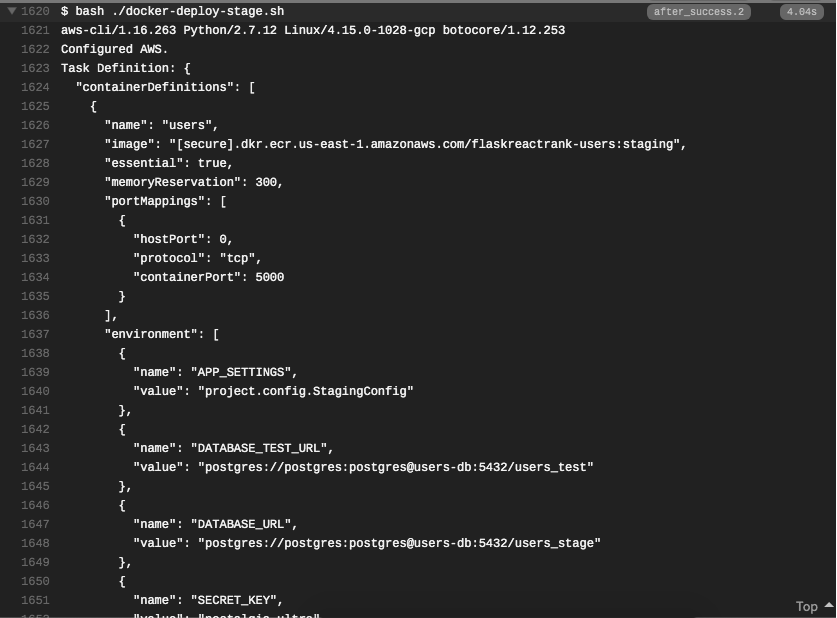
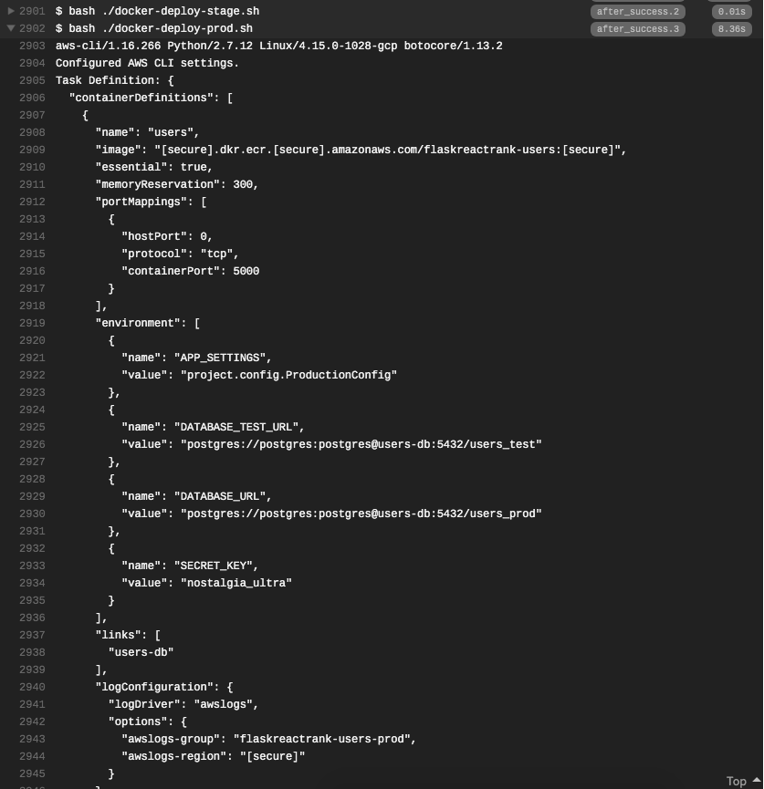

# FlaskReactRank #

FlaskReactRank is a web application loosely inspired by HackerRank built using microservices architecture, Test-Driven Development (TDD), Continuous Integration (CI) And Continuous Delivery (CD).

## Tools & Technologies ##

1. Python
2. Flask
3. PostgreSQL
4. ReactJS
5. Cypress
6. Swagger UI (Open API)
7. Amazon Web Services (EC2, ECS, ECR, RDS, Lambda, CloudWatch)
8. Docker, Docker Compose, Docker Machine
9. Nginx
10. Shell Scripting
11. Travis CI

## Users Service ##

The Users service is a RESTful API built with Python, Flask, PostgreSQL that handles user authentication and management and served with gunicorn.

The PostgreSQL database instance is mounted on to the Users's service as a volume via Docker Compose and mapped to the User model with Flask-SQLAlchemy. Database migrations are handled with the Flask-Migrate extension. When users are added to the database, passwords are hashed using Flask-Bcrypt and authenticated with JSON Web Tokens (pyjwt).

The API endpoints for the Users services are:
```
Endpoint       | HTTP Method | Authenicated? | Result
-----------------------------------------------------------------
/users         | GET         | No            | Get all users
/users         | POST        | Yes (admin)   | Add a user
/users/:id     | GET         | No            | Get single user
/users/ping    | GET         | No            | Sanity check
/auth/register | POST        | No            | Register user
/auth/login    | POST        | No            | Log in user
/auth/logout   | GET         | Yes           | Log out user
/auth/status   | GET         | Yes           | Check user status
```

Flask-Testing and Coverage.py are used for unit tests and code coverage. There are a total of 41 unit tests for the User's service with 84% coverage.

```
Module                           | Statements | Missing | Excluded | Branches | Partial | Coverage
---------------------------------------------------------------------------------------------------
project/__init__.py              | 28         | 14      | 0        | 0        | 0       | 50%
project/api/auth.py              | 64         | 20      | 0        | 10       | 2       | 70%
project/api/models.py            | 35         | 21      | 0        | 2        | 0       | 43%
project/api/users.py             | 70         | 28      | 0        | 14       | 2       | 64%
project/api/utils.py             | 39         | 13      | 0        | 12       | 3       | 69%
project/tests/__init__.py        | 0          | 0       | 0        | 0        | 0       | 100%
project/tests/base.py            | 14         | 0       | 0        | 0        | 0       | 100%
project/tests/test_auth.py       | 156        | 1       | 0        | 2        | 1       | 99%
project/tests/test_config.py     | 44         | 1       | 0        | 2        | 1       | 96%
project/tests/test_user_model.py | 51         | 1       | 0        | 2        | 1       | 96%
project/tests/test_users.py      | 169        | 1       | 0        | 2        | 1       | 99%
project/tests/utils.py           | 12         | 4       | 0        | 0        | 0       | 67%
---------------------------------------------------------------------------------------------------
Total                            | 682        | 104     | 0        | 46       | 11      | 84%
```

---

## Client Service ##

The Client service is the single-page front-end microservice built with functional class-based ReactJS components extending the main App.jsx React component.

The `Form.jsx` component renders login and registration forms and submit the form contents to the Users service using `axios` to validate the form contents and return a authentication token to the browser's local storage if validated.

Once a user is validated, the component's state is updated and allows users to access other other components that allow users to view a list of other users (`UsersList.jsx`), view their own status (`UserStatus.jsx`), and submit Exercises to the [API Gateway](https://aws.amazon.com/api-gateway/) which evaluates the submission using [AWS Lambda](https://console.aws.amazon.com/lambda/).

### React-Enzyme and Jest ###

The Client service uses Jest and React-Enzyme for unit testing, where each component's functionality is mocked and tested against. After each test passes, a snapshot is rendered to save the last successful state of the component. If the new snapshot does not match the contents of the previous one, the snapshots can be update in `watch` mode.

For CI builds, adding `CI=true` to the `package.json` file allows tests to pass in a CI environment:

```json
"scripts": {
        "start": "react-scripts start",
        "build": "react-scripts build",
        "test": "CI=true react-scripts test",
        "eject": "react-scripts eject"
}
```

Adding the `--coverage` flage will output a table to the console with a summary of the code coverage.

```
> client@0.1.0 test /usr/src/app
> CI=true react-scripts test "--coverage"

PASS src/components/__tests__/About.test.jsx
PASS src/components/__tests__/AddUser.test.jsx
PASS src/components/__tests__/Exercise.test.jsx
PASS src/components/__tests__/Exercises.test.jsx
PASS src/components/__tests__/Footer.test.jsx
PASS src/components/__tests__/Form.test.jsx
PASS src/components/__tests__/FormErrors.test.jsx
PASS src/components/__tests__/Logout.test.jsx
PASS src/components/__tests__/Message.test.jsx
PASS src/components/__tests__/NavBar.test.jsx
PASS src/components/__tests__/UsersList.test.jsx

File                    |  % Stmts | % Branch |  % Funcs |  % Lines | Uncovered Line #s |
------------------------|----------|----------|----------|----------|-------------------|
All files               |    47.77 |    47.37 |    43.42 |    49.77 |                   |
 src                    |    37.93 |    28.57 |    33.33 |    37.93 |                   |
    App.jsx             |    39.29 |    28.57 |    33.33 |    39.29 |... 02,110,118,124 |
    index.js            |        0 |      100 |      100 |        0 |                 6 |
 src/components         |    33.93 |    38.64 |    35.71 |    34.55 |                   |
    About.jsx           |      100 |      100 |      100 |      100 |                   |
    AddUser.jsx         |       75 |      100 |       50 |       75 |                 6 |
    Exercise.jsx        |       75 |     62.5 |       50 |       75 |                32 |
    Exercises.jsx       |    18.57 |       25 |    18.18 |    18.84 |... 37,146,174,182 |
    Footer.jsx          |      100 |      100 |      100 |      100 |                   |
    Logout.jsx          |      100 |      100 |      100 |      100 |                   |
    Message.jsx         |      100 |      100 |      100 |      100 |                   |
    NavBar.jsx          |    42.86 |    66.67 |       50 |       50 |          15,16,17 |
    UserStatus.jsx      |     8.33 |        0 |        0 |     8.33 |... 33,41,44,45,47 |
    UsersList.jsx       |      100 |      100 |      100 |      100 |                   |
 src/components/forms   |    69.88 |    59.09 |       75 |    77.03 |                   |
    Form.jsx            |    67.95 |    59.52 |    71.43 |    75.36 |... 62,63,65,66,99 |
    FormErrors.jsx      |      100 |       50 |      100 |      100 |                11 |
    form-rules.js       |      100 |      100 |      100 |      100 |                   |
------------------------|----------|----------|----------|----------|-------------------|
Test Suites: 12 passed, 12 total
Tests:       40 passed, 40 total
Snapshots:   14 passed, 14 total
Time:        12.973s
Ran all test suites.
```

The main components utilize PropTypes, which produces warnings during tests and to the console if there are issues with the props passed down to each component is of a different type than expected.

```jsx
import PropTypes from "prop-types";

// ...

class Form extends Component {
        // ...
};

Form.propTypes = {
    formType: PropTypes.string.isRequired,
    isAuthenticated: PropTypes.bool.isRequired,
    loginUser: PropTypes.func.isRequired,
    createMessage: PropTypes.func.isRequired
};

export default Form;
```

---

## Exercises Service ##

The Exercises service is a Flask RESTful API microservice that provides communicates with Users service to ensure that a user is authenticated before providing the exercises to the Client service, or allowing users with admin permissions to add exercises to the database.

The API endpoints for the Users services are:
```
Endpoint        | HTTP Method | Authenicated? | Result
------------------------------------------------------------------
/exercises      | GET         | No            | Get all exercises
/exercises      | POST        | Yes (admin)   | Add an exercise
/exercises/ping | GET         | No            | Sanity check check
```

Flask-Testing and Coverage.py are used for unit tests and code coverage. There are a total of 41 unit tests for the User's service with 73% coverage.

```
Module                   | Statements | Missing | Excluded | Branches | Partial | Coverage
--------------------------------------------------------------------------------------------------
project/__init__.py      | 26         | 12      | 0        | 0        | 0       | 54%
project/api/base.py      | 7          | 0       | 0        | 0        | 0       | 100%
project/api/exercises.py | 39         | 3       | 0        | 6        | 1       | 91%
project/api/models.py    | 13         | 9       | 0        | 0        | 0       | 31%
project/api/utils.py     | 50         | 12      | 0        | 12       | 3       | 73%
--------------------------------------------------------------------------------------------------
Total                    | 135        | 36      | 0        | 18       | 4       | 73%
```

---

## AWS Lambda ##

[AWS Lambda](https://aws.amazon.com/lambda) is a service provided by AWS Lambda that is used by Exercises and Client services the evaluates coding exercises submitted from the Client service. The advantage os using AWS Lambda is that it is serverless, enables continuous scaling, and only charges for the compute time used.

When an authenticated user clicks the `Run Code` button from the Client service's Exercise component, the `submitExercise()` method grabs the `REACT_APP_API_GATEWAY_URL` environment variable and posts to the AWS Lambda API endpoint:

```jsx
submitExercise(event, id) {
    const newState = this.state.editor;
    const exercise = this.state.exercises.filter(el => el.id === id)[0]
    this.setState(newState);
    const data = {
        answer: this.state.editor.value,
        test: exercise.test_code,
        solution: exercise.test_solution,
    };
    const url = process.env.REACT_APP_API_GATEWAY_URL;
    axios.post(url, data)
    .then((res) => {
            newState.showGrading = false
            newState.button.isDisabled = false
            if (res.data && !res.data.errorType) {
                    newState.showCorrect = true;
            };
            if (!rest.data && res.data.errorType) {
                    newState.showIncorrect = true;
            };
            this.setState(newState)
    })
    .catch((err) => {
            // ...
    });
};
```

AWS Lambda receives the coding exercise from the [React-Ace Editor](https://www.npmjs.com/package/react-ace-editor) and evaluates the code with the following Python 3.7 function:

```python
import sys

from io import StringIO

def lambda_handler(event, context):
    code = event["answer"]
    test = event["test"]
    solution = event["solution"]
    test_code = code + f"\nprint('{test}')"
    buffer = StringIO()

    sys.stdout = buffer
    try:
            exec(test_code)
    except Exception:
            return False
    sys.stdout = sys.stdout
    if buffer.getvalue()[:-1] == solution:
            return True
    return False
```

If the returned value is `true`, the grading wheel stops spinning and changes to a check mark and shows the message `Correct!`.

The AWS Lambda API Gateway endpoint can be tested manually using `cURL`:

```bash
curl -H 'Content-Type: application/json' -X POST \
$REACT_APP_API_GATEWAY_URL/v2/exec \
-d @- << EOF
{
    "answer": "def sum(x,y):\n    return x+y",
    "test": "diff"
}
```

## Swagger UI / Open API ##

Swagger UI uses Open API to document the usage of the Users service API, which is read `swagger.json` file.

The `update_spec.py` file is used to update the `url` parameter depending on which branch is currently being worked on (`development`, `staging`, `production`) so that the API documentation is accessible from the `Swagger` tab in the navigation bar on the application front-end.



## End-to-End Testing with Cypress ##

For end-to-end testing, Cypress is used to mock the full functionality of the application in an through commands such as `cy.visit()`, `cy.get()`, `cy.click()` and more. An additional dependency `randomstring` is used to generate random usernames to ensure that each test run is unique.

The following is a snippet of one of the cypress testing files:

```jsx
const randomstring = require('randomstring');
const username = randomstring.generate();
const `${username}@test.com`;
const password = "test_password";

describe("Exercises", () => {
    it('should display the exercises correctly if a user is not logged in', () => {
        cy.visit('/')
            .get('h1').contains('Exercises')
            .get('.notification-is-warning').contains('Please login to submit an exercise.')
            // ...

    });
});
```

## Continuous Integration and Delivery With Travis CI and AWS ##

For container orchestration, the application uses [Elastic Container Service](https://aws.amazon.com/ecs/), which allows the application to access to other convenient AWS services such as load balancing and auto-scaling as well as container registration with [Elastic Container Registery].

### AWS Services ###

Application Load Balancers (ALBs) are used, one for the `staging` branch and one for the `production` branch to allow a single point of contact between services.



Incoming traffic is distributed amongst each target group (or service) to allow the application to have increased availability. Each ALB also uses a Security Group, which acts as a firewall to control inbound and outbound traffic.



Each ALB uses _listeners_ to check for communication between target groups, which then determines how the load balancer will route requests to each service at its specified port number.





### Workflow ###

Each new feature is first developed in containers locally, where tests are written first to ensure they fail:

1. Each new feature is developed locally and tests first to ensure that they fail.

```bash
eval $(docker-machine env -u)
docker-compose up -d --build
docker-compose exec users python manage.py recreate-db
docker-compose exec exercises python manage.py recreate-db
docker-compose exec client npm test --coverage
```

2. The feature's code is written to ensure that the tests pass.
3. Once the tests pass, the feature is added to the staging branch.
4. The feature is pushed to GitHub to trigger a new build on Travis, which runs the test scripts based on the working branch.



5. Once the build passes, the `docker-push.sh` script, utilizing the AWS CLI tool, tags the images with the name of the current branch and pushes the images to [ECR](https://aws.amazon.com/ecr/).



6. The `docker-deploy-stage.sh` script updates the Task Definitions in [ECS](https://aws.amazon.com/ecs/), which are used to update the containers used by each cluster's Service.



7. A PR is opened from the `staging` branch against the `production` branch to trigger a new Travis build.

8. Once the build passes, the images are created, tagged as `production` and pushed to ECR, where the process repeats again using the `docker-deploy-prod.sh` script for the Production cluster.



9. When the changes are complete, the changes are merged into the `master` branch.
